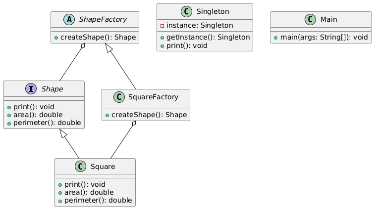

# Homework 7 - Design Patterns

**Author:** AJ Barea  
**Course:** SWEN-746 Model-Driven Development  
**Assignment:** Choose any two design patterns and implement them.

## Factory Method Design Pattern

1. **Product**: `Shape.java`
   - Defines the interface for the objects that the factory method creates.
2. **Concrete Product**: `Square.java`
   - Implements the `Shape` interface.
3. **Creator**: `ShapeFactory.java`
   - Abstract class that declares the factory method to return `Product` objects.
4. **Concrete Creator**: `SquareFactory.java`
   - Extends `ShapeFactory` and overrides the factory method to return `Square` objects.

## Singleton Design Pattern

1. **Singleton**: `Singleton.java`
   - Ensures that a class has only one instance and provides a global point of access to it.

## Class Diagram

